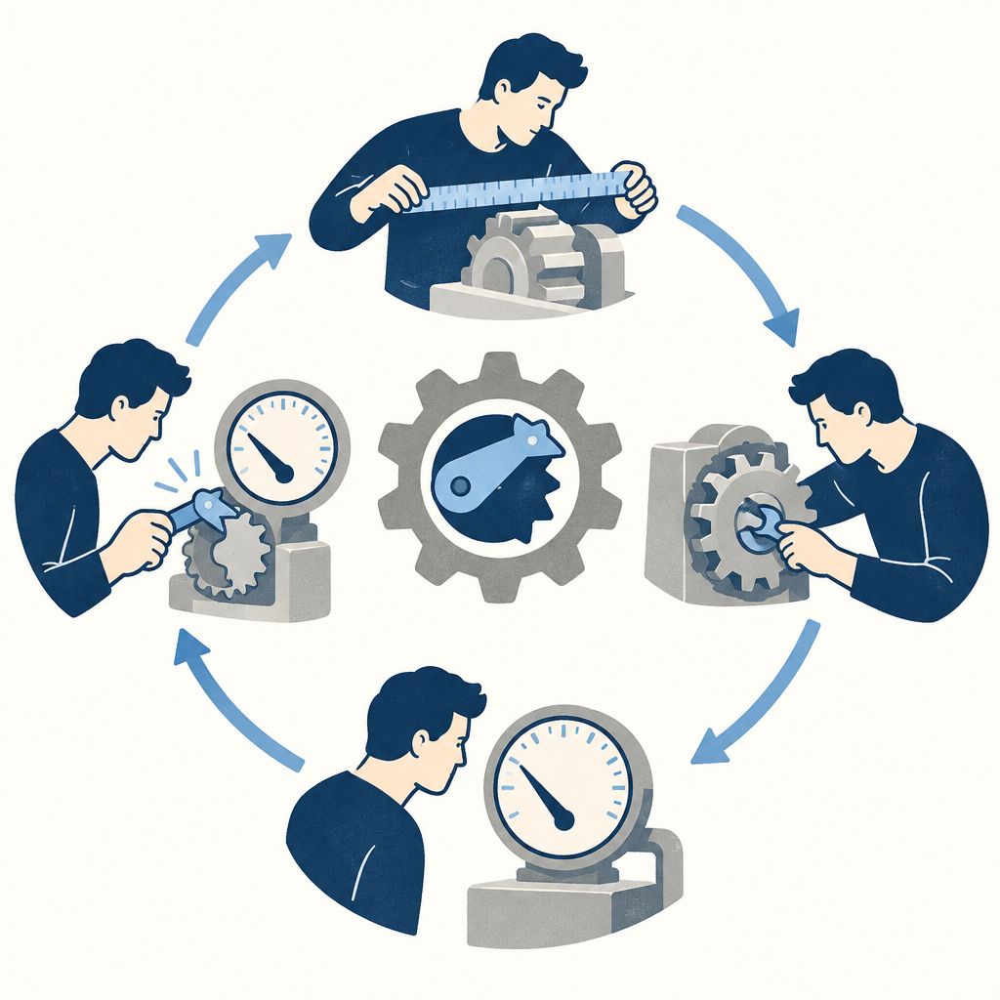

## 為什麼讀
Simon 2026-09-28 只貼網址進收件箱、未留收藏原因。題材是讓 AI 在客觀數字把關下自己迭代、人只管方向與批准，跟 vault 既有的迴圈工程同一條線，可當外部實例對照。

## 摘要
數位時代轉述 Anthropic 工程文章：團隊花兩週把 claude.ai 網頁版與桌面 App 的效能優化交給 AI 隊友 Claude Tag，合併 3,000 多次修改、零用戶事故，13 項指標平均快 3.1 倍。做法四步：給 AI 職務說明；先找量得準的指標並證明它跟用戶感受掛鉤；讓 AI 循環「先寫能重現慢點的測試、修改、上線看真實數據，有改善就把測試標準調嚴並固定、不准退回」；人負責催它大膽、拍板體驗、定方向。數字為公司自行公布。

## 核心概念
- [[loop-engineering]]：本篇是迴圈工程的實際案例。AI 每輪做同一套：先寫能重現慢點的基準測試、修改、上線後讀真實用戶數據；有改善就把測試門檻往下調並鎖住（之後不准退回），沒改善就關掉功能開關（可一鍵關掉新改動的設定）重來，再去找下一個慢點。停止訊號是客觀數字、不是 AI 自評；安全靠自動審查、至少一名工程師批准、功能開關與分階段上線（員工、1% 用戶、全面）。（數位時代轉述 Anthropic 工程文章）
- [[goodharts-law]]：指標一旦變成目標就容易失真，本篇示範事前防線。秒數會隨網路與機器浮動，團隊改讓 AI 壓每次量都一樣的代理指標（拿穩定的次數代替會浮動的秒數，例如程式執行的指令數、畫面重新繪製次數），但每把新尺上場前要先證明「壓低它，用戶真的覺得變快」，證明不了就撤掉，免得 AI 在無意義的數字上白忙。
- [[agent-job-description]]：衝刺前團隊在頻道裡給 Claude 一份常駐指令，寫法像新人的職務說明：負責範圍（產品效能的一切）、要主動做的六件事（監控每次部署、評估監測數據、維護儀表板、主動修小問題、提出值得做的專案、隨時回報），最後一句寫明「目標是盡量自主，但今天還做不到」。作用是把 AI 從「等人交辦」改成「對結果負責」，同時講清人還在迴圈裡的邊界。（數位時代轉述 Anthropic 工程文章）

## 對 Simon 的應用（當下想法）

> 以下為 reading 當下想到的應用、隨時間／工具／興趣變化可能已失效；後續落地狀態見下方「落地動作與效益」段（若有）。

兩類分開列：

**A. 芙莉蓮優化類**（可套到 Claude Code／skill／rules／CLAUDE.md／user-memory）：
- 芙莉蓮的健檢（harness 健檢、knowledge-wiki 健檢）若日後要新增一個統計數字當改善目標，可在對應規則檔加一條「新指標先寫明它跟實際摩擦或品質問題的對應證據，對不上就不採用」，對應原文「每把新尺都要先證明壓低它用戶真的有感」〔需 Simon 確認〕
- 每週資安週報排程（`~/.claude/scripts/weekly-intel-run.sh` 內給 `claude -p` 的提示詞）可對照原文職務說明的三要素「負責範圍／主動要做的事／跟誰回報」，檢查提示詞有沒有寫「主動要做的事」與「回報給誰」〔AI 推論〕

**B. Simon 個人動作類**（建 Notion Action 卡／動 vault／改個人工作流／看別的東西）：
- 下次公司系統切換時，若服務能分批改指向（例如先改少數帳號或部門的 DNS），才套用原文「員工先試、1% 用戶、再全面」的分段做法；原文「功能開關可一鍵關掉」對應的回退步驟則不論能不能分段都適用〔AI 推論〕
- 想看完整做法與原始數據，可讀原文列出的 Anthropic 工程部落格第一手文章〈How we made claude.ai 3x faster in two weeks〉〔原文支撐〕

## 原文要點
- 成果：2026 年 8 月兩週內合併 3,000 多次修改，零用戶事故、零次上線後退回；13 項核心操作指標第 75 百分位的幾何平均快 3.1 倍（比較 8 月 13 日與 8 月 27 日）。網頁版從開啟到可打字由 3.1 秒降到 0.55 秒；各項落差大，桌面 App 冷啟動只快 1.9 倍，Claude Cowork 雲端模式送出訊息快 19 倍。
- 分工：工作搬進一個 Slack 頻道，大量實作交給 Claude Tag（Anthropic 放進 Slack 的 AI 隊友功能，beta 版）；工程師定目標、做取捨、批准每一筆修改。
- 第 1 步職務說明：常駐指令列出六項職責，最後一句設下「方向是自主、但人還在迴圈裡」的期待與邊界。團隊列約 20 個改善專案、請 Claude 估算可省時間後訂目標，第 3 天就達成 13 項目標中的 12 項。
- 第 2 步找準尺：Claude 提出執行指令數、重新繪製次數等穩定指標，11 分鐘後 5 條討論串各自開工；每把新尺都要先證明跟用戶感受掛鉤，否則撤掉。
- 指標本身也可能量錯（這跟古德哈特定律不同：不是被當目標壓到失真，而是從一開始就量不到用戶感受）：側邊欄跳動案例中，業界常用的跳動指標只算出約 0.008 分、遠低於 0.1 警戒線，監控完全沒抓到用戶肉眼看得到的亂跳；改讀瀏覽器原始跳動資料後，才發現 31% 的載入在可操作後畫面仍在跳。（數位時代轉述 Anthropic 工程文章）
- 第 3 步自己試：每條討論串只處理一段流程，AI 循環「建基準測試、拆風險送審並加功能開關、上線讀真實數據、有改善就鎖門檻、沒改善就關開關重來」。側邊欄跳動案例：新測試舊版 20 次全失敗、修正版 20 次全通過。兩週建了近 200 個功能開關，結束前清掉一半以上。
- 第 4 步人的三份工作：推一把（Claude 預設謹慎，工程師要它「please be braver」後改口一小時內送出；目標達成後提醒「目標不是終點」）、拍板體驗（用戶看得到的改動附改前改後截圖由人決定）、定方向（一個 900 行只省 2 毫秒的修改被打回，理由是不值得多維護一套工具）。
- 適用條件：問題能變成穩定數字、已有自動化測試可設只降不升的門檻、能用功能開關與分階段上線。
- 限制：用的是 Anthropic 內部研究模型（原文形容大致相當於 Opus 5.5）；工程師有權隨時批准上線，多層簽核的公司會打折；《RuntimeWire》指出這是公司自行公布、未公開樣本與計算細節，也無法說明是否帶動留存或營收；最慢的 5%、其他流程與超長對話仍待改善。

## 原文全文

> [!info]- 原文全文（未公開）
> 原文全文只保留在本機 Obsidian、未同步到這個 garden。[在 Obsidian 開啟這篇 →](obsidian://open?vault=SimonVault&file=2-knowledge%2Freadings%2F2026-10-03-anthropic-claude-ai-3x-faster-sprint)

## 原始連結
- https://www.bnext.com.tw/article/92386/anthropic-claude-ai-3x-faster-performance-sprint
- 來源性質：二手 — 數位時代新聞轉述 Anthropic 工程部落格文章（Raymond Wang 等人），文末註明初稿為 AI 編撰，指令範本為依原文改寫的中文版；第一手版本：未找（原文資料來源列有 https://claude.dev/blog/how-we-made-claude-ai-faster/ ，本次未抓取驗證）
