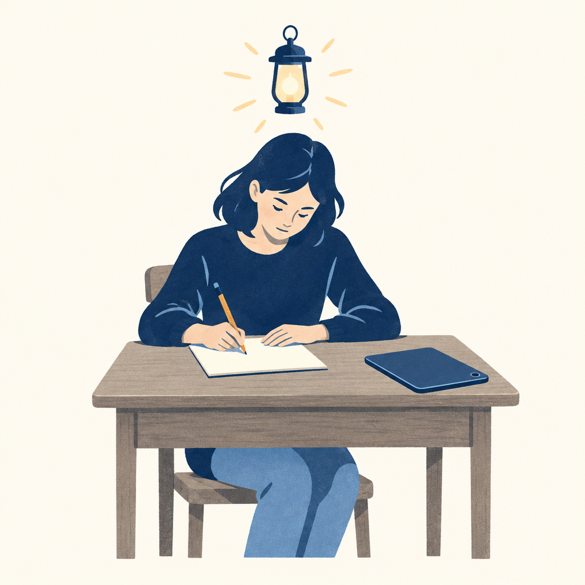

## 為什麼讀
收件箱只有網址、沒有收藏原因。受訪者李海碩就是 KW γ 先前借用「只取第一手、拒二手」原則的海碩校長，本篇是他在別人節目上近兩小時的長訪談，集中講 AI 時代的教育、學習方法與判斷力。

## 摘要
葳格國際學校總校長李海碩在張修修的節目談 AI 時代的教育與學習。他的主張是：AI 時代要學的東西沒有變，要把批判思考、溝通、學會學習這些持久技能做得更扎實，並把作業與考試難度往上調，以「有人願意買」當作夠好的標準。用 AI 時大腦一定要動，所以他的學校把作文改回課堂寫。他也分享在 Minerva 學到的「先找出不能改變的限制」、AI 使用者的四個層次、自己的四步學習法，以及韌性比硬撐重要。

## 核心概念
- [[cognitive-offloading]]：認知卸載，指把思考整段交給 AI、自己的大腦沒有動。李海碩引 Barbara Oakley（《學習如何學習》作者）的說法：學習一定跟大腦有關，用 AI 時大腦沒動就一定是錯的。他的學校開放 AI 後，學生回家寫的作文「全班變大文豪」，同題在班上重寫就全倒，從此作文一律在課堂完成；連「先叫 AI 給大綱」也不行，因為把想法重組成段落正是要練的東西。（李海碩訪談第 7、10 章）
- [[minerva-hc]]（`#constraint` 這一招）：Minerva 大學把可訓練的思考習慣（課內稱 HC）各編成一個標籤，`#constraint`（限制）是其中一招：先找出真正不能改變的限制，再圍著它建造。它要求先挑戰「這真的是限制嗎」：換個角度、借別人的力量就能繞過的不算限制；確定是限制後，就從它出發。他把這接到貝佐斯「接下來十年什麼不會變」的提問：AI 讓一切快速變動，只有押在不變的東西上才不會白做，例如他的幼兒園不教 AI 工具，因為孩子畢業前那些工具就全換了，跑跳與跟人互動才不會變。（李海碩訪談第 6、7 章）
- [[durable-skills]]：不會因技術變化而過時的能力。李海碩的碩士論文比對二三十個框架，結論都指向批判性思考、溝通、協作、創意、學會學習。他的「大實話」是 AI 時代不需要學一套全新的東西，而是把這些講了幾十年的基礎做得更好；真正的問題是現行教育體制很少真的在教，例如批判思考最適合在國文和歷史課練，卻沒有這樣教。（李海碩訪談第 7 章）
- [[human-first-machine-second]]（四步學習法）：先人後機是「用 AI 前先有自己的思考」。李海碩的四步學習法不是人先動手，而是 AI 只做萃取，「形成理解」這一步一定先由人講、再讓 AI 往下接，這是它跟先人後機相通的地方。第一步讓 AI 把閱讀材料的資訊萃取出來；第二步看著萃取結果，先跟 AI 講自己對每一點的想法和經驗；第三步把內容放進自己的「數位大腦」，立刻想怎麼用在當前的工作與挑戰；第四步請 AI 依他學到的內容和工作脈絡，排出「花最少精力和資源、最快產生結果」的前三件事，並約定自己一週內做完。分工是 AI 負責萃取，人腦負責理解、連結與決定下一步。（李海碩訪談第 16 章）
- [[persuasion-pillars]]：亞里斯多德的說服三要素，Ethos 是可信度、Pathos 是情感、Logos 是邏輯，三者要依序建立：先讓人信你（Ethos），才輪得到打動情感（Pathos），最後才是講道理（Logos）。李海碩認為 AI 讓產出情感與邏輯內容變得太容易，最後決勝在「你願意信誰」，也就是個人故事與可信度。主持人修修另外提出「人味金字塔」這個框架，分三層：值得被人傳說的出格之舉（remarkable）、讓人感同身受的挫折與脆弱（relatable）、言行一致的可信任，三層缺一不可、都要長期累積。（李海碩訪談第 20 章）

## 我的立場

> 針對本篇核心主張的表態；空槽待 Simon 事後填、未表態即留白，芙莉蓮不代擬。

1. AI 時代要學的東西沒有變，重點是把批判思考、溝通、學會學習這些持久技能做得更扎實。
   - **我的表態**：（待補：同意／不同意＋為什麼）

2. 用 AI 時大腦一定要動；連「先叫 AI 生大綱」都會跳過該練的組織能力，所以作文要回到課堂寫。
   - **我的表態**：（待補）

3. 「夠好」的新標準是做出來有人願意買、有人願意看。
   - **我的表態**：（待補）

4. AI 讓情感與邏輯內容容易量產，最後決勝在可信度與個人故事。
   - **我的表態**：（待補）

## 對 Simon 的應用（當下想法）

> 以下為 reading 當下想到的應用、隨時間／工具／興趣變化可能已失效；後續落地狀態見下方「落地動作與效益」段（若有）。

兩類分開列：

**A. 芙莉蓮優化類**（可套到 Claude Code／skill／rules／CLAUDE.md／user-memory）：
- 四步學習法的第四步「請 AI 排出最小投入、最快見效的前三件事，並訂一週期限」，KW γ 現行的「對 Simon 的應用」段只列候選、不排序也不訂期限；可考慮在收錄 high 篇時加一個「前三名＋一週內」的排序欄位，Simon 同意才改 skill〔原文支撐〕〔需 Simon 確認〕
- 李海碩做簡報的流程是先跟 Claude 多輪確定要講什麼，再請它檢查「論點之間有沒有少一段連結、幫我連起來」，然後才請它設計每一頁、最後用 ChatGPT 生圖；可拿這個「先補邏輯斷點、再排版」的順序對照 presentation-design skill 的敘事前置流程，確認是否已有檢查論點斷點這一步〔原文支撐〕〔需 Simon 確認〕
- right-problem skill 要求填限制條件；可考慮在該欄加一個檢查問句：「這條限制換個角度或借別人的力量能不能繞過？繞得過就不算限制」，對應 Minerva 的 `#constraint` 做法〔AI 推論〕〔需 Simon 確認〕

**B. Simon 個人動作類**（建 Notion Action 卡／動 vault／改個人工作流／看別的東西）：
- 下次讀完一個 CCNA 章節後，可試一次四步法的第二到第四步：先自己說出每個重點的理解，再請 AI 依 Simon 的實際工作（伺服器管理、資安治理）排出三件最小投入就能用上的事，一週內做完，看一週內有沒有做完那三件工作應用〔AI 推論〕〔需 Simon 確認〕。第二步「先自己說出理解」已由現行的 CCNA 費曼複習涵蓋，真正新增的只有第三、四步〔AI 推論〕
- 在 substack-publish 的素材包步驟加一題自檢「本篇有沒有至少一段只有我經歷過的工作場景或失敗」，下一篇發文時試用，對應受訪者「AI 時代決勝在你願意信誰」的說法〔AI 推論〕〔需 Simon 確認〕

## 原文要點
- 來賓與脈絡：李海碩是葳格國際學校總校長，Minerva 決策分析碩士（MDA），2026-07 起再讀 Minerva 的 Worldwide Executive Leadership Program；主持人張修修在開場宣傳自己 10 月中募資的 AI 課程。
- AI 是放大器：做出東西已經不難，難的是判斷為什麼做、怎麼做；AI 會放大厲害的人，也會放大沒想清楚的人。
- Minerva 評分分五級：3 分是完整答對，4 分是還能講出馬上可用的應用，5 分（獨角獸分）是讓全班知識往前推一步的出乎意料的應用；課堂上每一次發言與回應都被評分。
- 從 `#constraint` 與「什麼不會變」推出持久技能；幼兒園不教 AI，因為學到的工具撐不到畢業。
- 認知卸載：用 AI 時大腦沒動就是錯的；學校作文改回課堂完成，「先用 AI 生大綱」同樣跳過了該練的組織能力。
- AI 使用者分層：沒在用、只跟 ChatGPT 聊天（他認為最可惜）、能串多個工具（例：Claude 定內容加 ChatGPT 生圖，兩小時重做一場演講簡報）、能用 AI 改變自己的產業；最高一層是沿著 AGI／ASI 的趨勢線，推想自己的產業最後最缺什麼（他估 AGI 十年內到）。
- 評量要改：選擇題能猜、不精準，口說輸出躲不掉；AI 偵測工具有偽陽性問題（受訪者舉例 17 年前的博士論文被判三成以上是 AI 寫的）；Minerva 不禁 AI，反而假設學生會用 AI 而把難度上調，曾一晚指定約 400 頁閱讀。
- 「夠好」的新定義：作業或產品做出來有人會買、有人會看才叫夠好；AI 讓以學歷、資歷擋人的守門員失效。
- 學校的價值轉向「跟誰當同學」；公立學校「多做多錯」的文化讓努力的老師被排擠，教師流失嚴重。
- 不要等 100% 準備好才出發，三四成到六七成就可以動；孩子敢嘗試的前提是心理安全感；這個年代要的是韌性（被打倒能再站起來），不是刀槍不入的硬漢或咬牙硬撐。
- 高等教育（受訪者說法、未查證）：舊金山大學 2026 秋季起新生 AI 與創業必修；台灣 117 學年度（2028 年）起約八成學生可進公立大學；學位與證照制會轉向能力本位；STEM 要「加」Business，不是二選一。
- 醫療、運動、娛樂與人跟人的互動不會被取代，人機互動越簡單，人與人的互動越重要。
- 生成式 AI 給的是機率最高的平均內容，這個時代沒人需要平均內容，所以要先有自己的觀點，不能一開始就叫 AI 生。
- 英文仍逃不掉：最好的 AI 用英文訓練；語言教學分三層（語言正確、社會語言、語用），老師要往語用走；要證照就刷題，但分數不等於真實能力（多益 900 分講不出英文的人很多）。
- 觀察 AI 要看三個地方：美國（最前端）、中國（開源與影音生成）、歐盟（法規，受訪者稱已禁止 18 歲以下使用 AI 伴侶、未查證）。
- 先看美國的內容，台灣約慢三年，再把框架搬到更晚的市場。
- 成功靠累積與複利：李海碩演講比賽 2008 到 2014 年一直輸，之後年年得名；打電動死掉經驗值還在，「不要挑簡單的事做」，打一萬隻史萊姆也不會變強。

## 盲點與保留
**缺口／矛盾**：
- 多個具體事實是受訪者口述、節目內沒有出處：舊金山大學 2026 秋季 AI 與創業必修、台灣 117 學年度約八成學生可進公立大學、歐盟已禁止 18 歲以下使用 AI 伴侶、AGI 十年內到。原文要點已標「未查證」，要引用到工作或文章前得另外查。
  - **Simon 回應**：（待補：同意／不同意這個保留＋為什麼）
- 「有人願意買才叫夠好」沒交代學生作業怎麼找到真實買家或觀眾，也沒處理不以市場衡量的學習：例如證照考試，及格線仍是分數，受訪者自己也說要證照就刷題。
  - **Simon 回應**：（待補）
- 本篇談持久技能停在「把清單上的基礎做好」；同一位受訪者在 reading 2026-09-19-kiao-layer-beneath-durable-skills 已往下挖到「清單底下那一層」，本篇沒有接上那一層，兩篇要合看。
  - **Simon 回應**：（待補）
**過度吹捧／該打折**：
- 節目開場夾帶主持人自己 10 月中募資的 AI 課程宣傳，訪談內容與這層行銷要分開看。
  - **Simon 回應**：（待補）
- 「AI 偵測工具把 17 年前的博士論文判成三成以上是 AI 寫的」是單一軼事、沒有出處，拿來支撐「偵測工具不可靠」要打折。
  - **Simon 回應**：（待補）

## 第四問

> 這篇沒寫、但站在我的位置可以補上的，是什麼？（先人後機：補章由 Simon 親筆填、芙莉蓮不代擬；填完可喊「驗證我的補章」做文獻對照。）

- **我的補章**：（待補：從位置差／經驗差／時代差挑一個切入、手寫半頁、求真不求完整）

## 原文全文

> [!info]- 原文全文（未公開）
> 原文全文只保留在本機 Obsidian、未同步到這個 garden。[在 Obsidian 開啟這篇 →](obsidian://open?vault=SimonVault&file=2-knowledge%2Freadings%2F2026-10-03-haishuo-ai-era-good-enough)

## 原始連結
- https://youtu.be/-44fzYqJgqQ?si=D6b1f2tUR7AQB68h
- 頻道：張修修的不正常人類研究所；片長約 1 小時 51 分；2026-10-02 上架，節目內稱錄製於 2026-07-22。
