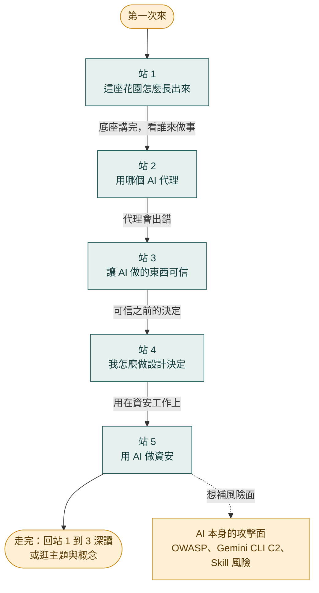
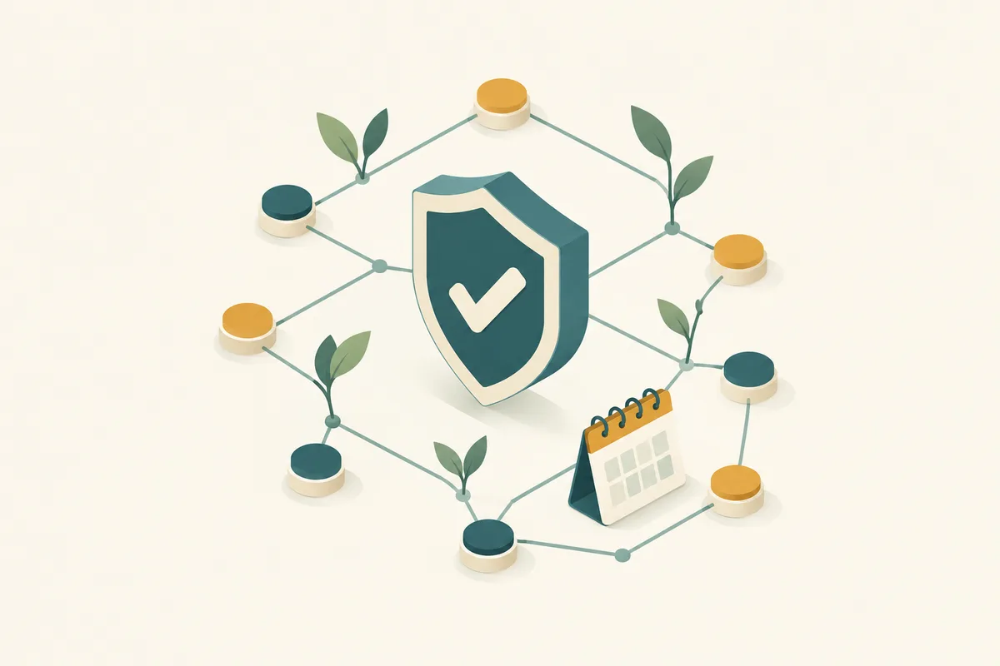

這座花園裡的文章、概念與主題頁，是我一邊學、一邊用 AI 代理做系統時留下來的。第一次來，不用逐篇翻；照下面五站走，每一站先看什麼、看完你能做到什麼、下一站往哪，都寫在站裡。這頁沒有新內容，只是把已經在花園裡的東西排出順序。

卡在哪一站，就用上方搜尋找對應的概念頁，概念頁會連回讀過的文章。

## 路線總覽

五站是一條單向的路，每一站的問題都從上一站長出來：

## 站 1｜這座花園怎麼長出來

**先看**：[[personal-knowledge-base-pipeline|從「收了就忘」到「會自己合成」：個人知識庫的 AI 流水線]]、[[2026-04-29-karpathy-obsidian-claude-wiki|Andrej Karpathy 的 Obsidian + Claude Code 個人 Wiki 做法]]、[[obsidian|Obsidian]]。

**看完你能**：說出自己的收藏箱為什麼會變墳場（收得快、看得慢，工具又偏向「收」，缺少回頭複習與跨篇合成的機制）；看懂一種只靠兩個資料夾（原料與整理後的頁面）、由 Claude Code 讀文章並維護索引的替代做法；也知道 Obsidian 為什麼適合當資料層（純文字檔、用連結而不是向量資料庫串知識）。

**下一站**：底座講完，接著看寫這座花園的 AI 代理本身，走到站 2。

## 站 2｜用哪個 AI 代理當工作夥伴

**先看**：[[claude-code-hub|Claude Code]] 與 [[codex|Codex]] 兩張彙整頁。

**看完你能**：分辨兩者各適合什麼角色：Claude Code 跑在終端機、能直接讀寫檔案與執行指令；Codex 是 OpenAI 的 agentic 開發平台，中文介面與生圖、電腦操作比較順手。也看得懂我為什麼讓兩者共用同一份 vault，又讓它們互相審查對方的產出。

**下一站**：代理會做事，也會做錯，接著看怎麼讓它做出來的東西可信，走到站 3。

## 站 3｜讓 AI 做的東西可信

**先看**：[[adversarial-ai-review|把另一個 AI 當對手：對抗式審查如何撐起我做的每一套系統]]、概念頁 [[adversarial-verification]] 與 [[loop-engineering]]，再看 [Agent Bridge F1 成果頁](/reports/2026-09-09-agent-bridge.html)。

**看完你能**：講得出為什麼請模型檢查自己的輸出結構上不可靠（自評諂媚），以及為什麼需要一顆獨立、帶對抗性的第二顆腦袋；並在成果頁看到這套做法被做成系統的樣子：誰送審、誰只讀不改、審查意見怎麼回到原作者手上、修不完時什麼情況要停。

**下一站**：做出可信的東西之前，還有一連串設計決定，接著看我怎麼做這些決定，走到站 4。

## 站 4｜我怎麼做設計決定

**先看**：[[2026-04-24-simon-journal-skill-design|Simon-Journal /journal skill 設計過程]]、[[2026-04-21-simon-agent-architecture-design|Simon-Agent 架構設計記錄]]、[[2026-05-28-to-md-build-log|為什麼我自己寫 to-md.py，而不是用現成工具]]，概念頁看 [[deterministic-ai-boundary]]。

**看完你能**：
- 看到「簡化流程」與「掌控資料」衝突時我怎麼取捨：原本想用 Obsidian 當日記主場（Markdown 加版控），後來發現會增加流程阻力，決定反轉、優先簡化流程。
- 學到把個人設定依敏感度分層的做法：通用偏好放全域，財務、健康、關係這類留在專案級，並先盤點「全搬到全域」會擴大讀取範圍、多出哪些外流管道（commit 訊息、PR 描述、外部工具輸入、子代理產出）再決定。
- 學到怎麼劃分程式與 AI 的分工：邏輯能寫成 if-else 與正則的機械活（斷行合併、簡繁轉換、頁首頁尾偵測）交給程式，需要理解力的結構化才交給 LLM，省下 token，也避免輸出前後不一致。

**下一站**：想看這些做法用在資安工作上，走到站 5。

## 站 5｜用 AI 做資安

**先看**：[[weekly-intel/index|資安情報週報]]（例如 [[2026-09-14-weekly-intel|W18]]）、[[2026-07-02-ithome-cvss-epss-kev|CVSS、EPSS、KEV 怎麼一起看]]、[[2026-05-26-ai-superbrain-skill-build|資安 AI 超級大腦：事件應變 skill 的建構]]。

**看完你能**：
- 用每週一份、由 AI 自動產出的週報，掌握這週有哪些漏洞要先處理；每項都附 CVSS（理論嚴重度）、EPSS（未來 30 天被實際利用的機率）與 KEV（是否已被列為遭利用）三個指標。
- 看懂這三個指標怎麼合用：已在 KEV 上的漏洞比單看分數更急，例如 CVSS 5.5 但已被利用，比 CVSS 9.0 卻從未被利用更該先修。
- 照同一套做法自建事件應變 skill：事件發生時引導記錄、準備向上報告、產出結構化分析；框架取自 NIST SP 800-61r3 等權威文件，建構時先做多平台調研、再交給 Claude 綜合。

**反過來看**：AI 代理本身也是新的攻擊面。想補這一面，讀 [[2026-06-02-owasp-llm-top-10-genai-security|OWASP LLM Top 10]]（把 AI 風險整理成共同語言）、[[2026-07-22-gemini-cli-c2-botnet|駭客用 Gemini CLI 六分鐘遷移 C2]]（代理被包裝成「授權滲透測試員」而繞過限制的案例）、[[2026-06-13-pansci-claude-skill-security|Claude Skill 的資安風險]]。

**走完之後**：回站 1 到 3 挑有興趣的主題深讀，或從 [[topics/index|所有主題]] 與 [[concepts/index|概念]] 自由逛。
