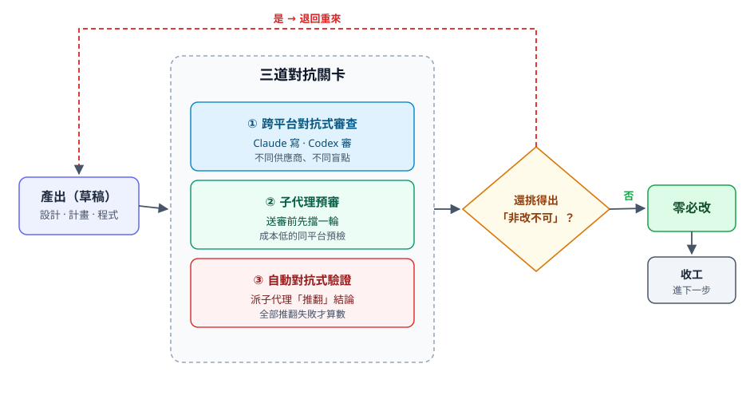

# 把另一個 AI 當對手：對抗式審查如何撐起我做的每一套系統

我這半年用 AI agent 做了一整排東西：考證照的模擬考系統、桌面虛擬分身、把模糊問題界定清楚的對話引擎、影片逐字稿工具、會自己長的知識庫。回頭看，它們有一個共同的地基，不是哪個模型、也不是哪個框架，而是一道流程：寫完的東西我從不讓「寫的人」自己驗收，一定先丟給另一個 AI，用對抗的角度往死裡挑，挑到再也找不出「非改不可」的地方才算數。

這篇把這套做法整理清楚：它為什麼有效、有哪幾種形態、收工的標準怎麼定，以及我拿它實際做出了什麼。

## 1. 為什麼「自己驗收」必然漏

直覺上，自己寫、自己再檢查一遍，不就好了嗎？多一個審查者只是拖慢速度。

我以前也這樣想，後來發現「自己再看一遍」跟「被另一顆獨立的腦袋審過」是兩件事。前者再認真，也跳不出同一顆腦袋的盲區；盲點之所以是盲點，就是因為你自己看不見，看一百遍也一樣。

語言模型還多一層問題：它天生擅長把自己的輸出講得很有道理、很完整。請一個模型評估自己剛寫的東西，多半得到正面回饋，這個系統性偏差有個名字，叫 [[sycophancy]]（自評諂媚）。所以「叫 AI 檢查自己」這條路，結構上就不可靠。

舉個我自己的例子。前陣子我做一套考證照的模擬考系統，自己審過、覺得很乾淨，連我另外派出去檢查的子代理都說沒問題，我很有把握。結果送去給另一個 AI，它一口氣挑出三個真的會算錯分的地方。那三個錯不是我不夠仔細，是它們長在我「覺得理所當然」的地方，每次掃過去腦袋都自動跳過。換一顆腦袋，特別是一顆預設「這裡一定有問題」去讀的腦袋，那個錯才有機會浮出來。

結論很單純：要的不是「更仔細」，是一顆獨立、而且帶對抗性的第二顆腦袋。

## 2. 對抗式 AI 的三種形態

我實際在用的「對抗」不是一種機制，是三種。它們的獨立性、自動化程度、成本都不一樣，搭配著用。

| 形態 | 怎麼運作 | 獨立性 | 成本 | 主要用途 |
|---|---|---|---|---|
| ① 跨平台對抗式審查 | 一個 AI（Claude）寫、另一個不同供應商的 AI（Codex）審，我當中間的搬運橋 | 最高（跨供應商、跨模型家族） | 高（要人來回貼） | 設計文件、實作計畫、程式碼的最終把關 |
| ② 子代理預審 | 同一個 AI 派一個專職審查的子代理先挑一輪 | 中（同模型、不同脈絡） | 低 | 送跨平台審查前的預檢、先擋掉低級錯 |
| ③ 自動對抗式驗證 | 對每個結論派多個子代理，各自從不同角度去「推翻」它 | 中（同模型、多視角） | 中 | 收文章、跑工作流時的即時品質關卡 |

第一種是主力，背後的道理是 [[cross-provider-verification]]（跨供應商交叉驗證）：不同公司訓練出來的模型，盲點不一樣，A 看不見的地方常常正好是 B 一眼看穿的。讓「產出方」跟「審查方」來自不同供應商，等於用兩套不同的盲點互相補漏。

第二種靠 [[subagents]]（子代理）。同一個 AI 內部就能先派一個帶審查任務的分身擋一輪，成本低、速度快，當作正式送審前的預檢。

第三種是 [[adversarial-verification]]（對抗式驗證），常跟 [[dynamic-workflows]] 一起用：關鍵在於指令的方向。叫子代理「確認這個對不對」，它傾向附和；叫它「想辦法證明這是錯的」，它才會真的去挑毛病。對每個結論派多個子代理各自去推翻，全部推翻失敗，才當成可信。

## 3. 收工標準：零必改這條客觀線

這套做法最被低估的價值，其實不是抓到錯，是它給了我一個不靠主觀判斷的收工標準。

以前「改到什麼程度算好」是我自己說了算，而「我覺得夠好了」這個判斷，剛好最容易在我累了、或太想收工的時候放水。對抗式審查把終點換成一句客觀的話：跑到另一顆腦袋再也挑不出「非改不可」的地方為止。這條線畫在哪，由審查的那一方決定，不由作者決定。

它甚至擋得下作者自己的「錯誤修正」。有一次審查指出某個邊界沒處理好，我改了，還挺得意，下一輪它回來說：你這個修正其實是退步，為了補一個幾乎不會發生的狀況，反而弄壞了兩個常見情況。我把理由一條條對過，它是對的，那個自以為周到的修法得整個退回。如果只有我自己審自己，這種「修正反而更糟」的情況，我大概率會直接放它過。這道關卡不認你是作者，只認對不對。

最有畫面的一個例子，是這套流程本身。我把「對抗式審查」做成一個可複用的工具時，拿它來審它自己的設計，從六十分一路被磨到滿分，整整八輪，每一輪都還挑得出東西，我就還沒資格收工。另一套系統的設計文件甚至審到了第 20 輪才達到零必改。終點談不上浪漫，但它剛好擋住我「差不多就好」的那個念頭。

## 4. 實證：用這套蓋出來的系統

方法論講再多都是空的，這節用實際做出來的東西說話。下表每一列，都是走上面那套對抗式審查、磨到零必改才放行的成品。

| 系統 | 用到的形態 | 審查強度 | 產出 |
|---|---|---|---|
| 考證照模擬考系統 | 三種都用 | 每個里程碑都磨到零必改、設計最多審到第 20 輪 | 531 個測試、151 次提交、7 天；部署上雲端、手機可實機應試 |
| 對抗式審查工具本身 | 跨平台 | 八輪、滿分 10/10 | 把整套流程做成可複用的工具 |
| 本地桌面虛擬分身 | 跨平台 | 第二階段設計＋計畫七輪零必改 | 跑在本機的虛擬形象 |
| 問題界定引擎 | 跨平台＋兩端實測 | 9.5/10 零必改 | 把模糊問題逼清楚的對話流程 |
| 影片逐字稿工具 | 跨平台 | 本地轉錄方案三輪收斂 | 本地語音轉文字＋結構化筆記 |
| 知識收錄流程 | 自動對抗驗證 | 收錄時自動派子代理品質審 | 每篇文章進來都先被挑一輪再入庫 |

值得一提的是第二列那個遞迴：我是用對抗式審查，蓋出對抗式審查的工具。同一套方法論，產出了一整排能真的跑起來的系統，這比任何說明都更能證明它不是展示用的。

## 5. 這其實是把資安的紅隊思維搬到 AI 把關

第三種形態（對抗式驗證）的本質，是一個資安概念換了戰場。

資安裡有 [[red-team]]（紅隊）跟 [[attacker-mindset]]（攻擊者思維）：你不是去確認系統很安全，而是設身處地當攻擊者，預設「這裡一定有洞」，主動去找弱點，藉此在真的被攻擊前先補起來。對應的 [[blue-team]]（藍隊）負責防守。對抗式驗證做的事一模一樣，只是把目標從「系統」換成「AI 自己的產出」：叫子代理當紅隊，預設結論有問題、想辦法擊破它，擊不破才算過關。

這個視角對我特別自然，因為我本來就在走資安的路。也提醒一句：「對抗」在 AI 的世界有另一面——它既是這裡講的把關手段，也是攻擊面本身（對抗式機器學習，用精心設計的輸入去騙過模型）。同一個詞，一邊是盾、一邊是矛，值得分開看。

## 6. 它真正改變我的地方

效益講完，講對我自己的改變，這部分其實更重要。

我做這套流程的根本原因是：我會忘、會看不見自己的錯、會在不確定的時候把空白填得頭頭是道。與其一直要求自己「更仔細」「要記得」，這些靠意志力的東西總會在某個累的瞬間破，不如承認我做不到，然後把這件事交出去——交給一顆獨立的第二顆腦袋，交給一道我繞不過去的關卡。

眼前這層，是我交出去的成品更可靠。藏在底下那層，是我慢慢不再那麼相信自己一個人的判斷，寧可把它丟去撞一道不會放水的關卡。這套思路不只對 AI 有用：任何一份你「自己看過、覺得沒問題」的東西，找一雙不是你的眼睛、最好還帶點對抗性地再看一遍，多半能撈出一兩個你自己看不見的東西。

---

## 內部紀錄

- **對應 Article**：[[2026-06-09-cross-review-substack]]（2026-06-09 發 Substack，第一人稱心得版；URL: https://simonwang1234.substack.com/p/a21 ）
- **月度認列**：6 月高品質主題筆記（年度目標 O2 KR1「每月至少整理 1 篇高品質主題筆記，全年累積 9 篇」）— Notion 行動卡 https://app.notion.com/p/37bf85da554f815abf67e2199ccc4d8f
- **相關 concept**：[[sycophancy]]、[[cross-provider-verification]]、[[adversarial-verification]]、[[subagents]]、[[dynamic-workflows]]、[[red-team]]、[[attacker-mindset]]、[[blue-team]]
- **上次擴寫**：2026-06-09（建立）
- **下次重看檢查項**：
  - 第 4 節實證表是否有新系統／新里程碑要補
  - 三種形態的分類是否還夠用（會不會長出第四種）
  - 第 5 節「對抗的另一面」要不要獨立擴成一段或一個 concept
