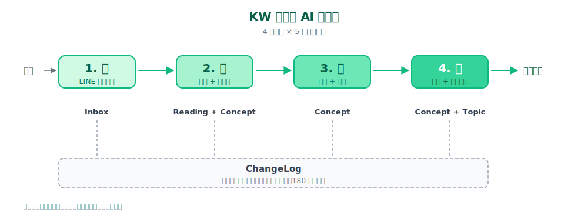

# 從「收了就忘」到「會自己合成」：個人知識庫的 AI 流水線

## 1. Inbox 收了就忘 — 不分工具的普世痛點

打開 Notion、Obsidian、或任何知識管理工具的 Inbox 區，看著一堆從 LINE、RSS、YouTube 收進來的文章和影片，你看過幾篇？

我問過幾個朋友，答案大同小異：沒看過、看過一次但忘了、想找的時候找不到。我自己中過這個坑。試過幾種主流工具、付過幾次訂閱費，每次都一樣：第一週認真用、第三週開始堆積、第三個月變墳場。最後變成怕打開 app、打開又罪惡感。

這跟工具無關。Notion 沒問題，Obsidian、Roam、Logseq、Heptabase 也沒問題。它們都很會儲存，沒一個解決 review。

我盯著這個現象看了一陣子，發現背後有結構性問題。

收的速度遠快過看的速度。每天滑手機收 5-10 篇是常態，週末有空回去看的能有 0.5 篇就算不錯。

收跟看的動能也不對等。收的當下出於衝動、FOMO、或「這篇好像有用」的直覺；看的當下得靜下心思考、寫下來、連結到既有知識。後者門檻是前者的 10 倍以上。

工具的設計向「收」傾斜。一鍵儲存、自動同步、AI 摘要、雙向連結都很方便，但沒有強迫 review 的機制、沒有過期淘汰、沒有跨文章的概念合成。

結論很單純：問題不在工具，在 workflow。

## 2. Inbox 不該是儲存倉，該是流水線

我把這個觀念寫下來、貼在桌面、看了很久。它的意思是：Inbox 裡的每一篇文章、每一個影片，應該都在「等被處理」，不只是「等被找到」。

儲存倉的邏輯是「先放著、需要時翻出來」，收得快、整齊、容易擴張，代價是 Inbox 永遠在長大、找不到 = 沒存過。流水線的邏輯則完全不同：每一篇進來都要往前走，經過抽概念、跟既有知識合成、過期淘汰三段，產出濃縮過的概念。

這個差別在實作上很關鍵。儲存倉只要好標籤 + 好搜尋；流水線需要 review 機制、合成邏輯、健檢規則。主流工具都沒做到第三件事。

我真正需要的，是一個會幫我看、抽、合成的助手。2025 年下半年起，AI 終於做得到了。

整套系統由五個元件組成、跑成一條流水線：

- **Inbox**：收件入口、LINE bot 收進來的原料
- **Reading**：一筆對一個來源（一篇文章或一支影片）。回答「這篇在講什麼」、保留來源連結 + 重點摘要 + 抽出的概念連結。它是「我看過什麼」的紀錄
- **Concept**：一筆對一個概念（像「Zero Trust」「prompt caching」這種小單位）。回答「這個概念是什麼」、由多筆 Reading 共同形塑、跨文章合成。它是「我懂什麼」的累積
- **ChangeLog**：所有動作的稽核日誌、每次新增 / 合併 / 擴寫都留紀錄
- **Topic**：跨多個 Concept 的整合主題頁、給自己看的、不對外發布。例如「個人知識庫設計」「資安市場觀察」這類敘事性整合。如果某個 Topic 寫得夠完整、會抽出來改寫成 Article 對外發、你正在讀的這篇就是這條路徑

Reading 跟 Concept 的互動：一篇進來會產生 1 筆 Reading + N 個 Concept；同一個 Concept 會被多筆 Reading 持續形塑、內容跟著長。這個 1:N 結構是後面「概念合成」設計的基礎。

## 3. 我的解法：4 段 AI 流水線

我把這五個元件串成 4 段：

| 段 | 動作 | 主要碰到的資料元件 |
|---|---|---|
| 1 | 收 | Inbox（LINE bot 收件） |
| 2 | 寫 | Reading + Concept（抓取、抽閱讀紀錄、抽概念、跨文章合成） |
| 3 | 維 | Concept（健檢、合併 / 封存 / 擴寫） |
| 4 | 用 | Concept + Topic（查詢命中、定期合成主題筆記） |

ChangeLog 是橫向稽核日誌、不在主線上、但每段動作都會寫紀錄。

整條線用 Claude Code 接 Notion MCP 跑。底下三個關鍵設計、橫切這四段都會碰到、是這條線能跑、不只是展示用的原因。

### 設計 1：意圖辨識

收藏的當下我要的是「先丟著、不要打斷我」；隔週末有空時是「批次消化十篇」；遇到重要文章時是「立刻幫我抽、立刻可查」。三個情境動能不同。

所以我讓 AI 辨識三種意圖：

- **「只收不析」**：說「先丟 Inbox」「等等再分析」→ 只建 Inbox 頁、🌱 狀態、不動 AI
- **「收藏並分析」**：說「幫我收這篇、順便收錄」→ 抓取 + 抽概念 + 寫 vault + 改 🌲
- **「批次消化舊 🌱」**：說「消化 Inbox 10 篇」→ 排隊處理、超過 10 篇先列成本預估表、二次確認再跑

讓使用者自己選被打擾的時機，收藏的阻力才會降到最低。

### 設計 2：Concept 合成

這是整套系統最核心的部分。

主流工具的做法是每篇文章建獨立筆記、之間靠雙向連結串起來。問題是同一個概念散在 10 篇筆記裡、每次想用都要回頭翻、整個知識網長期下來只會越來越亂。

我的做法是用概念當主軸、文章只是素材源。每次收錄一篇、AI 比對既有 Concept：

- **命中**：擴寫該 Concept 的合成段落、把新觀點融進去、source relation 加上
- **沒命中**：建新 Concept 頁，固定結構（定義 / 關鍵面向 / 應用場景 / 相關概念 / 尚未解決的疑問 / 來源）
- **每個 Concept 段落限 300-500 字**：寧短勿湊、防 AI 幻覺

每篇文章進來、整個知識網會「長」一點。原本散在多筆記裡的概念，會匯流到同一個 Concept 頁繼續長。

### 設計 3：Lint 健檢

收進來的概念也會過期。3 個月前覺得很有用的東西，現在可能根本沒查過。如果沒人淘汰、Inbox 跟 Concepts 都會變墳場。

每週日跑一次 lint，用 8 條規則掃出候選：

| 候選類型 | 觸發條件 |
|---|---|
| 冷門 | 最後一次被查詢超過 180 天 |
| 從沒用過 | 建立超過 90 天、從沒被查詢過 |
| 孤島 | 沒連到任何專案、最後一次被查詢超過 60 天 |
| 重複 | 有同名或同別名的另一個概念 |
| 待驗證 | 信心度標「待驗證」超過 30 天 |
| 缺漏 | 最近 N 篇文章收錄、都沒命中既有概念（可能缺新概念） |
| 太短 | 合成段不到 200 字、但已累積 3 篇以上來源 |
| 矛盾 | 兩個概念之間定義或內容衝突 |

掃完寫進「本週 Lint 候選」頁、我 review、選 archive / merge / verify / keep / expand。每個動作都寫進 ChangeLog（180 天保留）。

健檢這層讓系統能持續跑下去。沒有健檢的 wiki 半年內就變舊圖書館。

### 使用的工具

- **Claude Code**：所有收錄 / 健檢 / 查詢的中樞
- **Obsidian vault**：知識主場、放 Reading / Concept / Topic、`9-ops/` 放 ChangeLog 跟 lint 報告
- **Notion MCP + 資訊收集箱**：LINE bot 收進來的 Inbox 入口、Claude Code 從這裡讀待處理項目
- **Python script + Gemini Flash 備援**：YouTube 字幕抓取、無字幕時讓 Gemini 看影片產逐字稿、≤ 60 分鐘
- **Cloudflare Workers**：LINE bot 部署平台

主力 AI 用 Claude Pro、雜事用 Gemini 免費 tier、入口用 LINE 免費 + Cloudflare 免費。整條線除了原本訂的 Claude Pro，月費 0 元。

## 4. 上線約三週現況：誠實揭露

LINE 入口 2026-04-25 上線、寫這篇文章時約三週、中間 5/5 把知識主場從 Notion 三 DB 搬到 Obsidian vault、5/10 跑了第一次 lint 健檢。截至 2026-05-10 首跑數字：

| 指標 | 數字 |
|---|---|
| Reading 總頁數 | 30 |
| Concept 總頁數 | 145 |
| ChangeLog 條目 | 140 |
| Topic | 1（這篇本身）|
| lint 候選 | 0（10 條規則全空、表示 vault 還太新） |

數字看起來不錯、但 lint 候選 0 代表健檢層還沒被觸發過、要再過 1-2 個月才有資料能驗證「定期淘汰」的設計是否有效。這篇文章定位是「設計優先、實踐剛起步」的早期分享。我認為關鍵是 day 1 就要把意圖辨識、Concept 合成、lint 健檢建好、數字小只代表資料還不夠多。

舉一個實際收錄案例：4/26 我丟了一支三星 Galaxy A57 評測 YouTube 影片進去（vW-yQGijRUA）。這支影片沒字幕、原本系統的 Python script 抓不到、觸發了 v0.4 的 Gemini Flash 備援：用 Gemini 2.5 Flash 直接看影片產逐字稿（≤ 60 分鐘）。產出的逐字稿丟回收錄流程、抽出 3 個概念、建頁完成。整個過程我只說了一句「幫我收這個」。

3 個月後我會回來重看這份數字。如果到時 Concepts 沒長到 50+、查詢命中率沒到 80%+，我會回頭檢討設計的哪一條偏離預期。

## 5. 這是「個人 OS」第一塊

我把這個系統當作個人作業系統的第一塊。

PAI（Projects / Actions / Inbox）+ GTD + Second Brain 我都試過。我想往前推一步：把意圖辨識、自動收錄、概念合成、lint 健檢這些「以前要靠人做」的事、交給 AI Agent。我（人類）只負責丟原料、做最後檢視、跟 AI 對話調整工作流。

知識庫只是這個 OS 的第一塊。後面我會陸續寫：

- **學習歷程系統**：線上課程逐字稿怎麼變成 vault 結構、自動關聯 Notion Action 卡片
- **週復盤系統**：Notion 自動建空頁、Claude Code 寫總結、戰略視角串 OKR
- **決策日誌**：人生關鍵決策的紀錄、為什麼這樣選、回頭審視
- **財務系統**：月費 / 年化 / 投資三類分開追蹤、退休金倒推

每一塊都會走「設計優先、誠實揭露」的同一個敘事。

---

## 內部紀錄

- **對應 Article**：[[2026-05-13-knowledge-wiki-substack]]（2026-05-13 發 Substack、URL: https://simonwang1234.substack.com/p/ai-84e）
- **上次擴寫**：2026-05-13
- **下次重看檢查項**：
  - lint 候選是否開始有觸發（5/10 首跑 0 候選、預期 6/4 Rule E 先有）
  - Reading 是否累積到 50+
  - Concept 是否累積到 200+
  - Topic 自身要不要分章（節 1-5 結構是否還適用）
